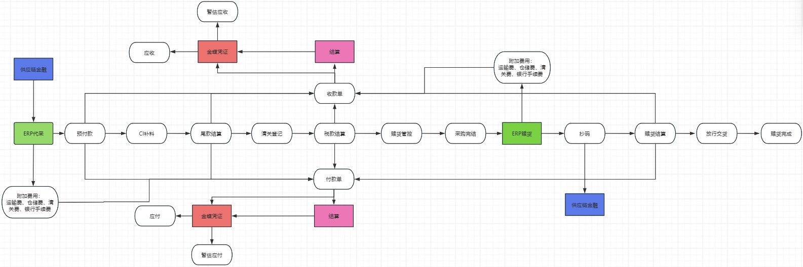

## 项目经验

####  [供应链金融&ERP](https://www.kdocs.cn/view/l/chzQTnohA3Mr)

2024.04-至今

内容：跨境冷链行业， 供金&贸易ERP管理系统，对接SCF供应链金融，结算平台 

赎货管理：赎回抄码，对接供应链金融 

财务管理：结算流水、差额欠款对接，收款、付款、赎货结算收付款处理 

服务费用：服务费用单，采购服务成本，销售收入服务单据管理

业绩：

1. 拉通3大类10+小类财务单据的收款，付款业务场景 

2. 实现跳过结算平台，ERP端收款，自行核销的便捷功能 
3. 对接金蝶，收付款以及暂估应付应收凭证及时推送

 

####  研发专业领域数字化

2023.06-2024.02

内容：研发专业领域涉机电器件相关的DGS\DGM数字化管理系统，开发单体 checklist升级维护流程 、以及器件单体评审流程。分为checklist库、升级提报单、单体评审库三大模块，单体评审流程分为单体设计、单体硬件、单体投模等六大类型。 架构：Spring Cloud Alibaba+MyBatisPlus+nacos+Redis+Feign+Rocket MQ+ES

业绩：1. 负责IT设计，发起需求评审以及开发评审，主导开发并跟进上线 

采用 BPM PLUS 流程引擎 

优化IPD流程服务，封装流程组件，实现高效流程开发 

接入IPD类型属性服务，实现业务字段可拓展 

采用魔盒平台任务调度，进行流程审批定时提醒 

采用ES实现流程列表高级检索 

解决Excel大数据量以及并发导入问题

####  PLM结构开发

2021.03-2023.06

内容：IPD集成产品开发-产品生命周期管理，PLM系统下OA电子流程开发，含结构设变评审、结构资料外发、治具图纸外发、结构小件 CBB  流程等PLM流程管理系统功能，以及对接 SRM供应商系统。 架构：Spring Cloud Alibaba+MyBatisPlus+nacos+Redis+Feign+Rocket MQ+ES

业绩：1. 负责IT设计，发起需求评审以及开发评审，主导开发并跟进上线 

2. 采用 activity /自研 BPM Plus  流程引擎，实现工作流开发 
3. 接入魔盒平台任务调度，实现超时任务自动跳过 
4. 接入IPD 类型属性服务，实现业务字段快速拓展 
5. 魔盒邮件服务，实现SRM发送人和抄送人提醒 
6. 接入TT 消息服务，完善待审批以及读者提醒
7. 监听流程服务MQ消息 ，自定义流程业务数据补偿机制

####   SOC安全运营中心

2019.10-2021.03

内容：互联网安全统一安全门户、安全产品服务运营与管理、自动化风险管理SOC平台，整合互联网SRC安全能力和资源，可视、高效、完善的一站式安全服务与解决方案，实现企业云平台安全能力升级，大数据分析处理。分为首页、鹰眼、谛听、天御、安全知识库几大核心模块。 架构：Spring Cloud+MyBatis+Eureka+Spring Cloud Gateway+Redis+RIbbon+Feign+HysTrix

业绩：

1. 鹰眼系统，从0到1开发流量监控分析平台，千万级数据查询优化，Tidb数据库接入以及多数据源切换 

2. 谛听系统，负责漏洞处置业务升级模块需求开发 
3. 安全首页2.0，完成首页应用重构和前后端分离改造 
4. 天御系统，负责安全防御系统日常维护 
5. 安全知识库，负责知识库后台管理系统日常维护

####   房易宝

2018.07-2019.09

内容：线上线下全渠道电商楼盘交易服务平台（移动APP+PC后台），房源覆盖知名品牌开发商在售楼盘,分为网上认筹、网上开盘、网上认购的三个交易内容，以及中台房源管理，后台协议模板、认筹批次管理 架构：Spring Cloud Alibaba+MyBatisPlus+nacos+jenkins+xxlJob+Redis+Feign+Kafka+ES

业绩：

1. 接入大数据平台同步拉取房源，消费MQ实现房源信息更新管理 

2. 协议模板在线预览和PPT导出 
3. xxljob定时流转在售房源状态 
4. 认筹批次、网上认筹、网上开盘、网上认购

####   祁东优选

2017.06-2018.07

内容：地方性移动端便民线上零售超市社交电商平台（公众号端），包含首页推荐、商品搜索、商品详情、购物车、用户中心、管理后台、单点登陆等模块，会员可浏览商品、搜索商品、使用购物车、购买下单，参加团购活动，邀请用户获得积分和优惠券，商家申请加入平台进行商品分销。 架构：Spring Cloud+MyBatis+Eureka+Spring Cloud Gateway+Redis+RabbitMq+ElasticSearch+FastDFS+SpringSecurity

业绩：

1. 采用 LUA+Openresity+Mysql+Redis 实现首页广告活动的页面缓存方案，高并发问题 

2. 使用 Thymleaf模板引擎技术实现商品详情页面静态化。 
3. 采用 Redis 实现商品购物车的存储 
4. ES 实现全站商品检索， RabbitMq接收消息实现商品上架，并实时更新索引库

####   富华美容

2016.02-2017.05

内容：美容整形在线医疗CRM管理平台，PC端以及公众号美容整形预约、形体单项、综合项、美容整形套餐管理，客户预约数据分析图和分析表 架构：Springboot + SpringMVC + Mybatis+ Redis+Mysql+Quartz+Dubbo+Zookeeper

业绩：

1.  用户预约功能开发，接入阿里SMS 

2. 体检单体项目管理开发 
3.  体检综合项目管理开发，检查项模块分组 
4.  套餐管理采用七牛云存储上传套餐图片，Quartz执行定时任务清理无效的图片

####  华强电子ERP & CRM

2015.07-2016.01

内容：华强北数码产品批发渠道客户通用 ERP & CRM 管理系统，入库出库管理，搜索模块，样品展示、客户管理几大模块。 架构：Spring boot+MyBatis+ElasticSearch+Mysql+SpringSecurity

业绩：

1. 使用 Thymleaf 模板引擎技术实现样品展示详情页面 

2. 利用 ES  实现全站检索功能，提供样品的搜索功能 
3. 完成客户站点的部署上线

####   安卓逆向

2013.07-2015.07

内容：

1. 基于安卓手机、机顶盒、车机等智能终端设备的系统逆向开发 

2. 嵌入式底层驱动移植，内核裁剪，性能调优
3. 设备ROOT提权，APK拆包、Dex反编译、Resource资源提取 
4. ROM镜像拆解、封装，Recovery、ROM刷机方案适配

