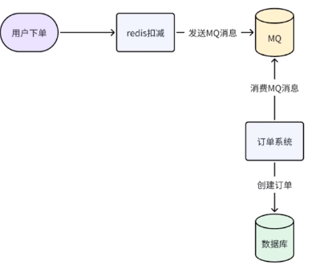

## 处理方案

1.系统拆分

比如一个大型单体应用，我们可以把他拆成多个微服务应用模块，每个模块对应数据库，可以降低访问压力。

如果是其中的某个服务并发量大，可以做器群扩展。

2.缓存加速

不会经常变化的数据，放到缓存里面，降低数据库的访问次数，提升性能。要处理数据一致性问题，缓存雪崩，穿透问题。

3.MQ削峰，异步处理

将大量请求，改为消息队列来处理，使数据库的读写压力降低。即便是单机的MQ消息队列，也可以几万的并发请求。

4.数据分离 分库分表 读写分离

主库-->用户库，内容库，2000并发，到2000+2000并发

用户库数据太大，进行水平拆分，查询的时候根据拆分规则，去查询的数据。

通过垂直和水平拆分，解决了数据库成为性能瓶颈的问题

读写分离，主节点写，从节点读

5.服务监控

埋点，日志监控

**Sentinel**：面向分布式服务架构的高可用流量防护组件，以流量为切入点，提供限流、流量整形、熔断降级、系统负载保护、热点防护等功能，同时具备完备的实时监控能力，可在控制台查看接入应用的单台机器秒级数据及小规模集群的汇总运行情况。

## 业务场景

#### **1.秒杀系统**

前端：

1.秒杀页面静态化，

2.CDN加速（就近访问），

3.点击后倒计时，

4.nginx限流拦截无效请求（同IP,ID,商品）,减少服务器压力

后端：

1.redis+lua,  库存预扣减，商品库存信息预加载，下单后lua脚本判断原子性，redis集群
2.异步下单，用户下单先redis扣减，发送MQ到消息队列，消费消息的时候创建订单，更新数据库   

3.兜底方法和容错机制

熔断降级，Sentinel配置

数据校对，库存校对，  定时任务对比redis和数据库的

热点隔离：专用秒杀，可以专用的redis和db

原则：前端解决的不要放到后端，宁可少卖不要超卖

